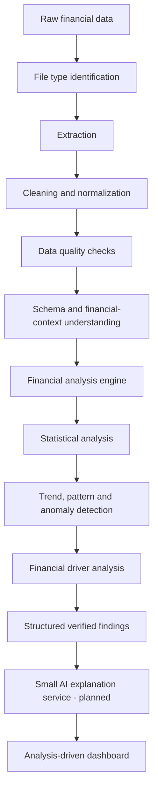
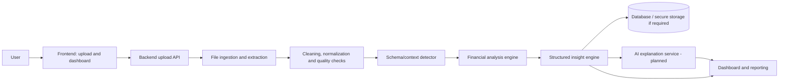
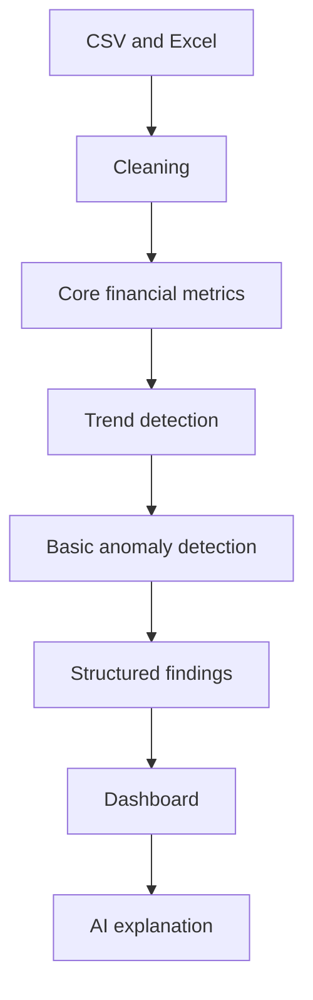

# Automated Financial Intelligence Pipeline
## Product Research and Technical Scope Document

**Status:** Proposed - early-stage data understanding and planning  
**Document purpose:** Shared research, scope, and implementation reference for finance and technical team members.  
**Positioning:** Financial analytics, reporting, monitoring, and decision support - not professional financial advice.

---

## Executive Summary

This project proposes an **Automated Financial Intelligence Pipeline** that accepts user-provided financial data, understands its structure, performs deterministic financial and statistical analysis, and presents verified findings through a context-aware dashboard. A compact artificial intelligence (AI) model may later convert those structured findings into clear, readable explanations.

The intended value is not an unrestricted "upload data and ask a language model" workflow. Numerical calculations, trend identification, anomaly flags, and financial rules belong in a transparent data and analytics pipeline. The AI layer is deliberately downstream: it explains approved structured findings in plain language. This separation improves reliability, debugging, validation by finance-domain members, and control of hallucination risk.

The realistic first target is personal-finance transaction data in CSV and Excel/XLSX formats. The MVP will focus on fields such as date, description, category, amount, and income/expense type. DOCX extraction, PDF bank statements, business financial statements, investment analysis, and advanced forecasting are subsequent scope areas.

> **Key design principle:** deterministic computation produces the facts; AI communicates the facts.

## Table of Contents

1. Project Context and Intended Workflow
2. Existing Projects and Research References
3. Research Comparison and Opportunity
4. Proposed System and MVP
5. Financial Analysis Scope and Personalization
6. Technical Architecture
7. AI/ML Role and Governance
8. Finance and Technical Team Responsibilities
9. Development Roadmap
10. Evaluation, Limitations, and Risks
11. Future Scope and What We Should Build First
12. References

---

## 1. Project Context and Intended Workflow

### 1.1 Objective

The proposed system will allow a user to upload financial information and receive a structured overview of relevant metrics, trends, patterns, anomalies, and explanatory insights. Initial input formats are CSV and Excel/XLSX; DOCX is a planned extraction format, and PDF is a future phase because it may require OCR and document-layout handling.

### 1.2 End-to-End Pipeline



**Technical explanation:** The system isolates stages so each transformation and calculation can be inspected, tested, and corrected. It first derives structured, machine-checkable findings from normalized data.

**Finance/business interpretation:** A user should see conclusions that can be traced back to financial records and rules, rather than unexplained text generated directly from an uploaded file.

### 1.3 Critical AI Boundary

The AI model is **not** the primary financial calculator. Python, Pandas, NumPy, statistics, and finance-domain rules should calculate and verify numerical results. For example, the analysis engine may derive:

| Verified finding | Example value |
|---|---:|
| Income | INR 60,000 |
| Expenses | INR 48,000 |
| Savings | INR 12,000 |
| Savings rate | 20% |
| Shopping change | +58% |

The AI explanation layer may then state: *"Expenses have increased over the last three months, with shopping as a major contributor. This increase is associated with a lower savings rate."* The wording must remain faithful to the supplied findings and should not invent transactions, causes, predictions, or recommendations.

This architecture supports:

- Reliable and reproducible numerical calculations
- Easier debugging and auditability
- Lower hallucination exposure
- Clear separation of computation from language generation
- Validation by finance-domain team members before insight text is shown

---

## 2. Existing Projects and Research References

The following repositories are references for individual capabilities and design lessons. They are not claimed to be components of this project, and their capabilities must not be attributed to the proposed system without separate implementation and validation.

### 2.1 Personal Finance Dashboard

**Repository:** [vinzalfaro/personal-finance-dashboard](https://github.com/vinzalfaro/personal-finance-dashboard)

This reference is a personal finance dashboard using Python, Pandas, Plotly, Streamlit, and SQL. Its stated focus is expenditure data and analytics for spending, budgeting, money inflows/outflows, and financial patterns.

| Aspect | Relevance to proposed system |
|---|---|
| Main problem addressed | Tracking and visualizing personal-finance activity |
| Key lesson | A dashboard can make spending and cash movement more understandable |
| Does not establish | A full automated financial interpretation, anomaly, and AI-explanation pipeline for our project |
| Proposed differentiation | Our system aims to add structured data understanding, automated trend/anomaly analysis, and an AI-assisted explanation layer |

### 2.2 Streamlit Exploratory Analysis

**Repository:** [camilasbraz/streamlit-exploratory-analysis](https://github.com/camilasbraz/streamlit-exploratory-analysis)

This reference allows CSV or Excel uploads and automated Exploratory Data Analysis (EDA) through profiling. EDA is the systematic examination of a dataset before deeper modelling. Relevant concepts include descriptive statistics, missing values, outliers, correlations, distributions, trends, and patterns.

| Aspect | Relevance to proposed system |
|---|---|
| Main problem addressed | General automated dataset exploration |
| Key lesson | File upload and automated profiling can reduce the manual effort required to understand a dataset |
| Does not establish | Finance-specific schema interpretation, metric selection, or financial meaning of detected patterns |
| Proposed differentiation | The proposed system intends to add a financial-domain intelligence layer over general data analysis |

### 2.3 FG-Data-Profiling

**Repository:** [Data-Centric-AI-Community/fg-data-profiling](https://github.com/Data-Centric-AI-Community/fg-data-profiling)

The repository identifies itself as the renamed successor to ydata-profiling / data-profiling. It provides automated data profiling and EDA for Pandas and Spark DataFrames, including type inference, missing values, duplicate detection, univariate and multivariate analysis, correlations, time-series analysis, seasonality, data-quality alerts, and exportable reports.

| Aspect | Relevance to proposed system |
|---|---|
| Main problem addressed | General-purpose profiling and data-quality understanding |
| Key lesson | Profiling and quality alerts can form a useful early validation stage |
| Does not establish | A dedicated financial intelligence engine or finance-specific interpretation rules |
| Proposed differentiation | It may inspire or support profiling; the proposed system adds financial context, metrics, drivers, and dashboards |

### 2.4 Financial Statement Analysis

**Repository:** [tenPro4/pandas_financial_statement](https://github.com/tenPro4/pandas_financial_statement)

This reference concerns financial statement analysis, including revenue, expenses, profit, profit margins, balance sheet, cash flow, financial trends, and business segments. It helps identify possible financial metrics and relationships that finance-domain members may eventually choose to include.

It does **not** mean the proposed system already implements all statement-analysis metrics. Business financial analysis is an advanced/future scope and needs finance-team definition, data mapping, and validation.

### 2.5 S&P 500 Stock Analysis Dashboard

**Repository:** [Chennakeshav2003/SP500-stock-analysis-dashboard](https://github.com/Chennakeshav2003/SP500-stock-analysis-dashboard)

This is not the proposed application's target use case. It is a reference for financial market analysis techniques, such as returns, growth, risk, volatility, correlation, performance, and market trends. These concepts may inform future investment analytics and visualizations, subject to appropriate data sources and validation.

### 2.6 Personal Finance Tracker

**Repository:** [DoshiHarsh/Personal-Finance-Tracker](https://github.com/DoshiHarsh/Personal-Finance-Tracker)

This type of application focuses on personal financial record keeping: income, expenses, categories, transactions, budgets, and account balances. Its key lesson is the importance of understandable categorization and records.

The proposed project differs in primary workflow: rather than requiring a person to maintain every financial record manually, it aims to accept existing financial data and automatically analyze it.

---

## 3. Research Comparison and Opportunity

| Project | Primary Purpose | Input | Analysis | Visualization | Automation | Financial Intelligence | AI Explanation | Our Extension |
|---|---|---|---|---|---|---|---|---|
| Personal Finance Dashboard | Personal finance tracking and analytics | Financial/expenditure data | Spending, budgeting, inflow/outflow analytics | Yes | Partial | Reference | No stated AI layer | Add automated context, findings, and explanation |
| Streamlit Exploratory Analysis | Generic EDA | CSV, Excel | Profiling and descriptive exploration | Yes | Yes | No, general-purpose | No | Map generic analysis to financial meaning |
| FG-Data-Profiling | Data profiling and quality analysis | Pandas/Spark DataFrames | Types, missingness, duplicates, correlations, time series | Reports | Yes | No, general-purpose | No | Use as a profiling reference/component candidate |
| Financial Statement Analysis | Statement analytics | Financial statements/data | Revenue, expense, profit, margins, cash flow concepts | Reference | Reference | Reference | No stated AI layer | Select validated business metrics in a later phase |
| S&P 500 Dashboard | Market analysis | Market data | Returns, risk, volatility, correlation | Yes | Reference | Reference for market analytics | No stated AI layer | Potential future investment module |
| Personal Finance Tracker | Record management | User-maintained financial records | Income/expense/budget tracking | Reference | Partial | Reference | No stated AI layer | Analyze uploaded existing records automatically |
| **Proposed system** | Automated financial intelligence | CSV/XLSX MVP; DOCX/PDF planned | Financial metrics, trends, patterns, anomalies, drivers | **Planned** | **Planned** | **Planned** | **Planned, downstream only** | Integrate validated stages into one pipeline |

### 3.1 Research Gap / Opportunity

The references demonstrate complementary pieces: personal-finance analytics and visualization; automated dataset exploration; data profiling and quality analysis; statement metrics; market analytics; and record management. The proposed system aims to combine selected ideas into an integrated, financial-context-aware workflow.

This is not a claim that no comparable system exists. The intended contribution is the project team's proposed differentiation: data ingestion and quality checks followed by finance-defined analysis, structured findings, and a constrained AI explanation layer that supports a dynamic dashboard based on detected financial context.

---

## 4. Proposed System and MVP

### 4.1 User Journey

1. A user uploads `expenses.xlsx`.
2. The system identifies the file and extracts tabular content.
3. It normalizes columns such as `Date`, `Description`, `Category`, `Amount`, and `Income/Expense`.
4. It checks completeness, duplicates, invalid dates, category consistency, and amount formats.
5. It detects the financial context and runs applicable rules and statistics.
6. It returns verified metrics and findings in a dashboard. A planned AI service turns only those findings into concise insight cards.

For illustration only, the engine could identify food spending changing from INR 5,000 to INR 6,000 to INR 7,200 to INR 8,500, or flag an INR 35,000 shopping transaction as unusually large relative to historical shopping activity. Such flags require configured methods and validation; an anomaly is not automatically fraud or an error.

### 4.2 Structured Findings Contract

```json
{
  "income": 60000,
  "expenses": 48000,
  "savings": 12000,
  "savings_rate_percent": 20,
  "major_trends": [],
  "anomalies": [],
  "expense_drivers": [],
  "risk_flags": [],
  "provenance": {"period": "configured analysis period", "rules_version": "tracked"}
}
```

Values above are illustrative, not research results or implemented output. In implementation, each finding should carry a period, method/rule version, supporting fields, and confidence or review status where appropriate.

### 4.3 Realistic MVP Definition

| Area | MVP commitment |
|---|---|
| Inputs | CSV and Excel/XLSX |
| Target data | Personal-finance transaction data |
| Core fields | Date, description, category, amount, income/expense |
| Outputs | Income, expenses, savings, savings rate, category breakdown, monthly trends, top categories, basic anomalies, structured insights, dashboard |
| AI | Planned explanation of verified structured findings; model training follows a working analytics output |
| Explicitly deferred | DOCX/PDF extraction, OCR, full statement analytics, investment analytics, forecasts, advice/recommendations |

---

## 5. Financial Analysis Scope and Personalization

### 5.1 Phase 1 / Core Analysis

- Total income, total expenses, net savings, and savings rate
- Expense distribution and category-wise spending
- Monthly and period-over-period comparisons
- Income-versus-expense trends
- Largest expense categories and recurring expenses
- Basic anomaly detection
- Trend and structured insight generation

**Technical explanation:** Metrics are calculated from cleaned records and explicit aggregation rules. Basic anomalies may be identified through transparent, selected statistical or rule-based thresholds.

**Finance/business interpretation:** The core answers practical questions: where money is going, whether spending is changing, whether income covers expenses, and which activity deserves review.

### 5.2 Phase 2 / Advanced Analysis - Planned

- Trend detection, seasonality, and correlation analysis
- Expense-driver and cash-flow analysis
- Financial ratios, profitability, and margin analysis
- Business financial statement analysis
- Investment performance, volatility, and risk indicators
- Forecasting and more advanced anomaly models

Correlation means two measures move together; it does not prove that one caused the other. Advanced metrics need clearly specified input requirements and finance-team validation.

### 5.3 Analysis-Driven Dashboard Generation

The dashboard should not be generic. The detected schema and financial context should select relevant analyses and presentation.

| Detected context | Likely dashboard focus |
|---|---|
| Personal finance | Income, expenses, savings, debt, cash flow, spending patterns |
| Business finance | Revenue, COGS, gross profit, operating expenses, net profit, margins, cash flow |
| Investment data | Portfolio value, returns, allocation, volatility, performance, risk |

This is **dynamic dashboard based on detected financial context**: data structure and validated analysis determine the visible insight cards and visualizations.

---

## 6. Technical Architecture



| Component | Technical responsibility | Finance/business interpretation |
|---|---|---|
| Frontend | File selection, validation feedback, dashboard display | A simple route from upload to usable insight |
| Upload API | Controlled receipt, metadata capture, size/type checks | Reduces failed or unsupported uploads |
| File processing | Parse CSV/XLSX; planned DOCX/PDF paths | Converts source records into usable data |
| Normalization | Standardize dates, signs, currencies/formats, labels; record quality issues | Ensures calculations compare like with like |
| Schema/context detector | Identify possible fields and financial data category | Selects appropriate analysis rather than forcing one template |
| Financial analysis engine | Metrics, ratios where approved, rules, aggregations | Produces traceable financial facts |
| Statistical insight engine | Trends, outliers, patterns, drivers | Surfaces meaningful changes for review |
| AI service | Constrained language generation from finding contract | Makes validated findings easier to understand |
| Dashboard/reporting | Context-specific cards, tables, charts, downloadable report | Lets users act on an understandable overview |
| Storage, if needed | Secure records, findings, rules versions, access metadata | Supports persistence, privacy, and auditing |

Security architecture is a required design area, not an optional add-on: financial files need encrypted transport, restricted access, retention rules, safe logging, and a data-deletion approach before production use.

---

## 7. AI/ML Role and Governance

### 7.1 Proposed Small AI Model Scope

The model is a future design decision and can be explored in Google Colab after a deterministic pipeline produces stable structured findings. Candidate directions include a small instruction-tuned language model, a fine-tuned compact transformer, and parameter-efficient approaches such as LoRA or QLoRA where suitable. No final model selection or completed training is assumed.

| Input to AI service | Output from AI service |
|---|---|
| Metric, change, period, category, severity, supporting statistics, finding, and allowed wording constraints | Human-readable explanation or insight card |

The model should not receive a raw financial document as the basis for primary calculations. It should be required to cite or link its own structured finding identifiers internally, use uncertainty language when supplied, and be blocked from generating unverified advice.

### 7.2 Financial Decision Support vs Financial Advice

The initial product should be framed as financial analytics, financial insights, financial monitoring, financial reporting, and decision support. It is not professional financial advice, a guaranteed investment recommendation, or a guaranteed profit/loss prediction. Any future recommendation layer needs specific finance-domain validation, appropriate safety review, and careful user-facing framing.

---

## 8. Finance and Technical Team Responsibilities

| Finance-domain team | Technical team | AI layer |
|---|---|---|
| Define meaningful metrics and ratios | File ingestion and extraction | Summarization and explanation |
| Validate financial interpretations and relationships | Cleaning, transformation, analytics engine | Natural-language generation |
| Define trend, anomaly, and risk thresholds | Statistical methods, backend/API, dashboard | Simplification of approved findings |
| Decide which insights are useful | Testing, monitoring, secure deployment | No primary calculation or unverified advice |
| Review generated findings | Model integration after analytics are stable | |

Finance knowledge and technical implementation are complementary. A technically correct calculation can still be financially unhelpful; a useful financial concept can still be unsafe if its data mapping or calculation is unreliable.

---

## 9. Development Roadmap

| Phase | Objective | Expected output | Dependencies | Success criteria |
|---:|---|---|---|---|
| 1 | Problem definition and financial requirements | Approved MVP data contract and metric definitions | Finance-team workshops | Scope and exclusions agreed |
| 2 | Sample datasets | Representative, permissioned test files and edge cases | Phase 1 | Dataset coverage documented |
| 3 | CSV ingestion | Validated CSV parser and upload flow | Phases 1-2 | Supported CSV files ingest with clear errors |
| 4 | Excel ingestion | XLSX sheet/column extraction | Phases 1-2 | Required sheets/fields extract correctly |
| 5 | DOCX extraction | Planned text/table extraction prototype | Defined document formats | Only after tabular MVP is stable |
| 6 | Cleaning and normalization | Quality report and standard transaction schema | Phases 3-4 | Test transformations are traceable |
| 7 | Core analytics | Metric engine for MVP outputs | Phase 6, finance rules | Finance review confirms calculations |
| 8 | Trend/pattern/anomaly detection | Configured, testable insight methods | Phase 7 | Findings are reviewable and useful |
| 9 | Structured insight engine | Versioned findings contract | Phases 7-8 | Dashboard can consume findings without AI |
| 10 | Dashboard | Personal-finance MVP dashboard | Phase 9 | Users can understand core results |
| 11 | Small AI model training | Evaluated explanation experiment in Colab | Stable findings corpus | Faithful explanations meet target criteria |
| 12 | AI integration | Guarded explanation service | Phase 11 | Text is traceable to findings |
| 13 | Testing and validation | Functional, financial, privacy, and usability results | All relevant phases | Release criteria passed |
| 14 | Deployment | Controlled production/pilot environment | Security and validation readiness | Monitoring and support process ready |

---

## 10. Evaluation Criteria, Limitations, and Risks

### 10.1 Evaluation Criteria

| Area | Measures to define and test |
|---|---|
| Data pipeline | File ingestion success rate, extraction accuracy, cleaning accuracy |
| Analytics | Metric correctness, trend-detection accuracy, anomaly quality, financial-rule correctness |
| AI | Faithfulness to structured findings, hallucination rate, explanation quality, readability |
| Dashboard | Usability, relevance of displayed metrics, personalization, clarity |
| End-to-end | Upload to analysis to insight to explanation to dashboard completion |

Metrics and acceptance thresholds should be defined against labeled test cases and finance-team review, not assumed from a model demonstration.

### 10.2 Honest Limitations

- Uploaded financial data may be incomplete, inconsistent, or ambiguously labeled.
- Different users and institutions may use different terminology and formats.
- Financial conclusions depend on data quality and the documented rules selected.
- An anomaly is a deviation from an expected pattern; it is not proof of fraud or an invalid transaction.
- Correlation does not establish causation.
- AI-generated explanations may still be incorrect or overconfident without guardrails.
- Financial recommendations require domain validation and careful legal/compliance review.
- Financial data is sensitive; privacy, access control, and secure storage are essential.
- The system should communicate uncertainty rather than presenting unsupported conclusions as facts.

### 10.3 Project Risks and Mitigations

| Risk | Why it matters | Initial mitigation |
|---|---|---|
| Technical variability | Files and schemas differ significantly | Define a narrow MVP contract; report unsupported formats clearly |
| Financial interpretation risk | A correct number can be misleading in context | Finance-team validation and versioned rules |
| AI hallucination | Narrative can exceed evidence | Structured-input-only AI, output checks, no advice claims |
| Data privacy | Financial records are highly sensitive | Minimize access, protect storage/transit, define retention/deletion |
| Data quality | Missing/incorrect values distort results | Quality checks, warnings, and traceable corrections |
| Scope creep | Too many formats/domains delay core value | Protect CSV/XLSX personal-finance MVP |
| Model-training limits | Training data and evaluation may be insufficient | Begin with templates/rules and evaluate before fine-tuning |
| Performance/scalability | Large files can affect response time/cost | File limits, asynchronous jobs, performance testing |

---

## 11. Future Scope and What We Should Build First

### 11.1 Future Scope - Planned

- PDF bank statements, OCR, and controlled document extraction
- Bank API integrations and multiple financial accounts
- Business financial analysis and investment analysis
- Forecasting, budget recommendations, cash-flow forecasting, and financial-health scoring
- More advanced anomaly detection and explainable AI
- Multi-user support, cloud deployment, role-based access, and secure document storage
- Feedback-driven model improvement and carefully validated personalized recommendations

### 11.2 What We Should Build First



AI model training should come **after** the deterministic analysis pipeline has a working, testable structured output. This sequence creates the evidence base needed to evaluate whether explanatory text is accurate and useful.

### 11.3 Expected Final Product Vision

A user uploads financial data without needing to know Python, Pandas, Seaborn, Matplotlib, statistics, or SQL. The system handles the analytical work and presents a financial overview, important metrics, trends, patterns, anomalies, major financial drivers, explanations, visualizations, and personalized insights. The first deliverable is deliberately narrower: trustworthy personal-finance CSV/XLSX analysis before broader document and financial-domain coverage.

---

## 12. References

1. [Personal Finance Dashboard - vinzalfaro](https://github.com/vinzalfaro/personal-finance-dashboard)
2. [Streamlit Exploratory Analysis - camilasbraz](https://github.com/camilasbraz/streamlit-exploratory-analysis)
3. [FG-Data-Profiling - Data-Centric-AI-Community](https://github.com/Data-Centric-AI-Community/fg-data-profiling) - repository described as the renamed successor to ydata-profiling / data-profiling.
4. [Pandas Financial Statement - tenPro4](https://github.com/tenPro4/pandas_financial_statement)
5. [S&P 500 Stock Analysis Dashboard - Chennakeshav2003](https://github.com/Chennakeshav2003/SP500-stock-analysis-dashboard)
6. [Personal Finance Tracker - DoshiHarsh](https://github.com/DoshiHarsh/Personal-Finance-Tracker)

---

## Final Quality Check

- Existing reference projects and the proposed system are separated throughout.
- All advanced capability language is labeled as proposed, planned, future, or illustrative where appropriate.
- AI is an explanation layer, not the primary calculator.
- Finance-team responsibilities, a constrained MVP, privacy, limitations, evaluation, and risks are included.
- Repository links above are the reference URLs supplied for this document.
